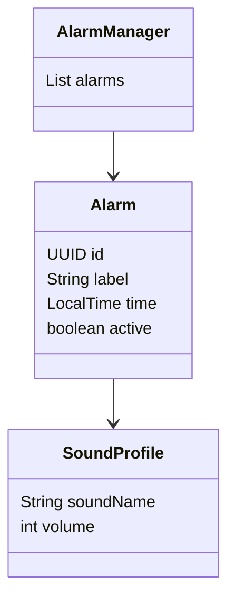

# Diagrama de clases inicial

```mermaid
classDiagram

AlarmManager --> Alarm
Alarm --> SoundProfile

class Alarm{
    UUID id
    String label
    LocalTime time
    boolean active
}

class AlarmManager{
    List alarms
}

class SoundProfile{
    String soundName
    int volume
}
```
