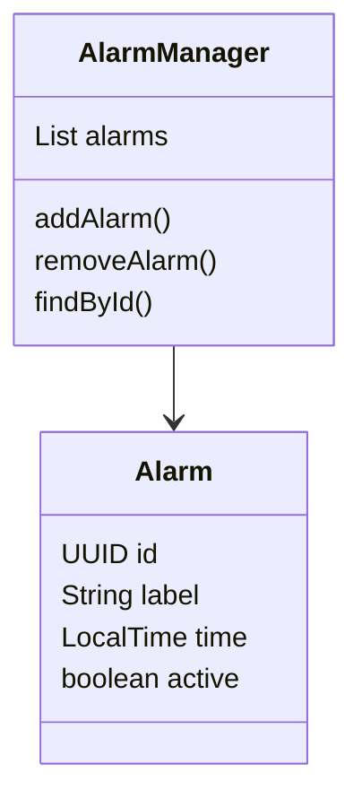

```mermaid
classDiagram

AlarmManager --> Alarm

class Alarm{
    UUID id
    String label
    LocalTime time
    boolean active
}

class AlarmManager{
    List alarms
    addAlarm()
    removeAlarm()
    findById()
}
```
